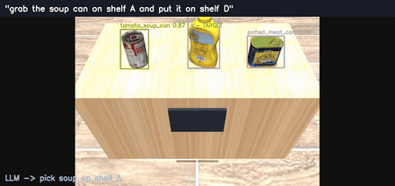

# Detect · Plan · Grasp

**Language-driven robotic manipulation** — a spoken command sends a mobile robot to *find, pick, and
deliver* the right object. A trained, INT8-quantized detector drives an analytic grasp on a mobile
base, planned with A\*, commanded in natural language grounded by a local LLM. Every stage verifies
itself: **perceive → decide → act → verify.**



> **"grab the soup can on shelf A and put it on shelf D"** → the robot parses the command, detects
> the soup among distractors on shelf A, drives over, grasps it, A\*-navigates around the shelves,
> and places it **upright** on shelf D — all detector-driven, no ground-truth pose.

## The system

Four cleanly separable stages, each independently validated, wired into one loop:

- **Perception (learned, optimized).** A YOLOv8-nano detector on the 21 YCB-Video objects, run
  through a full inference-optimization sweep — ONNX → **INT8 quantization** → benchmark — as a
  **torch-free** ONNX Runtime path. Detections are back-projected through depth into 3D positions.
  *(The ML-systems half.)*
- **Language (grounded).** A **local LLM** (Llama 3.2-3B via Ollama) turns a free-form command into a
  validated `{object, source, dest}` task, grounded against the store's shelf contents — with a
  deterministic rule parser as fallback. *(The reasoning layer.)*
- **Planning & control (from scratch).** Analytic grasp planning with a **verify-and-retry** grasp
  check, from-scratch **6-DOF Jacobian IK**, and **A\*/RRT** navigation around obstacles, in a MuJoCo
  physics sim. *(The robotics half.)*
- **Integration.** One command flows end to end: parse → navigate to the source → detect the object
  among distractors → grasp → navigate to the destination → place upright.

## How it got here

Built bottom-up, one verified milestone at a time (visual timeline + per-phase deep-dives in the
docs vault):

`01` block pick-and-place → `02` detector-driven grasp → `03` multi-object detection →
`04` language-driven rearrangement (local LLM) → `05` path planning (RRT-Connect) →
`06` **mobile manipulation** (detect · navigate · deliver) → `07` **prompt-driven store** (the capstone).


## Results (measured)

| Stage | What | Result |
|---|---|---|
| Data | YCB-Video (BOP) → YOLO labels | 900 val imgs, leak-guarded |
| Train | YOLOv8-n on **real** data (vs synthetic) | **mAP50 0.80** (0.41 synthetic → sim→real gap closed) |
| Optimize | ONNX → INT8 (detection head kept FP32) | **2.1× smaller, 1.5× faster**, −2.4% mAP (CPU) |
| Lift | depth back-projection → 3D position | **~30 mm** error, verified vs ground-truth poses |
| Grasp | analytic planner + 6-DOF Jacobian IK, closed loop | detector-driven grasp on the tabletop (vs 2.5% no-perception baseline) |
| Mobile | detect → grasp → A\* navigate → place | delivers the commanded object **upright** across the scene |
| Store | natural-language command → end-to-end delivery | LLM-grounded pick-and-place among distractors, across shelves |

The detector genuinely drives the robot: the arm renders its camera, the INT8 YOLO detects the
object, its box is lifted to a 3D world position, and the robot grasps and delivers it — an object it
was **not** told the location of.

**Honest limit:** the two-finger parallel gripper reliably handles cans and mugs; wide boxes, tapered
bottles, and thin curved objects are detected but defeat the pinch grasp — a learned grasp model is
the natural next step.

## Stack

Python · Ultralytics YOLOv8 · ONNX Runtime · INT8 quantization · MuJoCo · Ollama (Llama 3.2) ·
OpenCV · NumPy. From-scratch Jacobian IK, analytic grasp planning, A\*/RRT navigation.
Training on Colab GPU; inference, LLM, and sim run locally (CPU / Apple-Silicon, torch-free).

## Run it

```bash
python -m venv .venv && ./.venv/bin/pip install -r requirements.txt
bash sim/fetch_assets.sh                              # restore Panda meshes (gitignored)

# --- perception (needs a trained best.onnx in runs/ycb_artifacts — see notebooks/train_colab.ipynb)
./.venv/bin/python src/quantize_int8.py               # INT8 model
./.venv/bin/python src/benchmark.py                   # size / latency / mAP sweep
./.venv/bin/python src/lift_to_3d.py                  # 3D lift vs ground truth

# --- closed-loop grasp
./.venv/bin/python sim/run_detector.py --trials 25    # tabletop, detector-DRIVEN

# --- mobile manipulation & the prompt-driven store
./.venv/bin/python sim/make_scene_room.py             # (re)generate scenes
./.venv/bin/python sim/mobile_task.py tomato_soup_can # detect → grasp → navigate → place
./.venv/bin/python sim/store_language.py              # LLM command → validated task (needs `ollama serve`)
./.venv/bin/python sim/store_task.py "grab the soup can on shelf A and put it on shelf D"
```

## Dataset

[YCB-Video](https://bop.felk.cvut.cz/datasets/) (via the BOP benchmark) — 21 household objects with
6D pose, masks, and depth. Only a subset is used; data is not committed.
