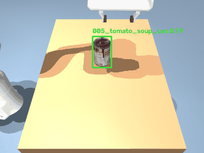

# Detect · Plan · Grasp

**A robotic manipulation pipeline: a fast, optimized object detector given a body.**
From an RGB-D view, the system detects objects, lifts each 2D detection into 3D, plans a
grasp, and executes it on a simulated arm — measuring **grasp success rate**, not just
detection accuracy.



## The idea

Two cleanly separable halves, each independently validated:

- **Perception (learned, optimized).** A YOLOv8-nano detector on the 21 YCB-Video objects,
  run through a full inference-optimization sweep — ONNX → INT8 quantization → benchmark —
  as a **torch-free** ONNX Runtime path. *(The ML-systems half.)*
- **Action (deterministic geometry + control).** Back-project the detection's depth into a
  3D point cloud, plan a grasp analytically, and execute it via from-scratch Jacobian
  inverse kinematics in a MuJoCo physics sim. *(The robotics half.)*

Detection feeds planning; planning feeds motion; the loop verifies itself
(**perceive → decide → act → verify**).

## Results

| Stage | What | Result |
|---|---|---|
| Data | YCB-Video (BOP) → YOLO labels | 900 val imgs, leak-guarded |
| Train | YOLOv8-n on **real** data (vs synthetic) | **mAP50 0.80** (0.41 synthetic → sim→real gap closed) |
| Optimize | ONNX → INT8 (detection head kept FP32) | **2.1× smaller, 1.5× faster**, −2.4% mAP (CPU) |
| Lift | depth back-projection → 3D position | **~30 mm** error, verified vs ground-truth poses |
| Plan + Execute | analytic grasp planner + 6-DOF Jacobian IK | grasp succeeds in MuJoCo |
| Evaluate | closed loop, 40 randomized trials | **97.5% grasp success vs 2.5% baseline** |

Deep per-phase write-ups (with figures + interview prompts) live in `dpg-docs/`.

## Stack

Python · Ultralytics YOLOv8 · ONNX Runtime · INT8 quantization · MuJoCo · OpenCV · NumPy.
Training on Colab GPU; inference & sim run locally (CPU, torch-free).

## Run it

```bash
python -m venv .venv && ./.venv/bin/pip install -r requirements.txt
bash sim/fetch_assets.sh                       # restore Panda meshes (gitignored)
# perception (needs a trained best.onnx in runs/ycb_artifacts — see notebooks/train_colab.ipynb)
./.venv/bin/python src/quantize_int8.py        # INT8 model
./.venv/bin/python src/benchmark.py            # size/latency/mAP sweep
./.venv/bin/python src/lift_to_3d.py           # 3D lift vs ground truth
./.venv/bin/python sim/run.py --trials 40      # closed-loop grasp success
```

## Dataset

[YCB-Video](https://bop.felk.cvut.cz/datasets/) (via the BOP benchmark) — 21 household
objects with 6D pose, masks, and depth. Only a subset is used; data is not committed.
