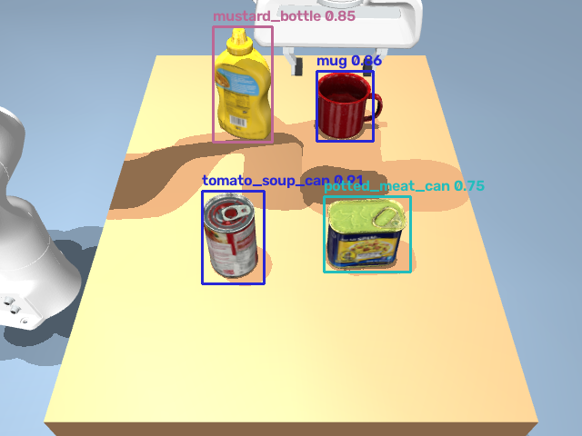
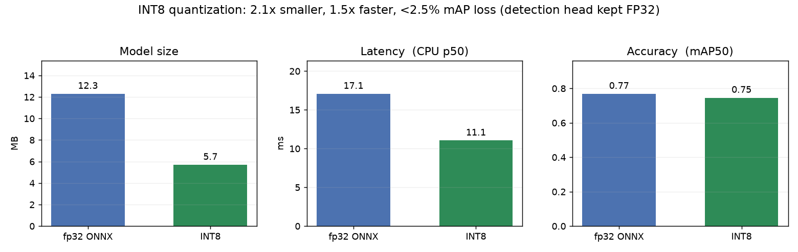
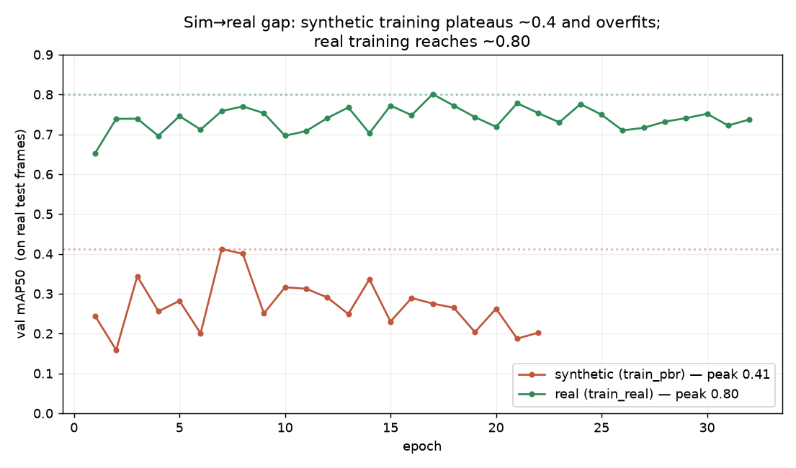
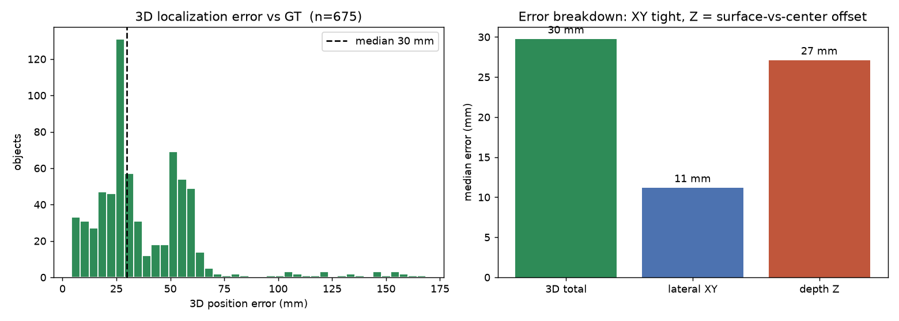
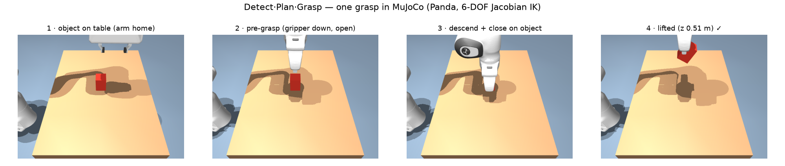
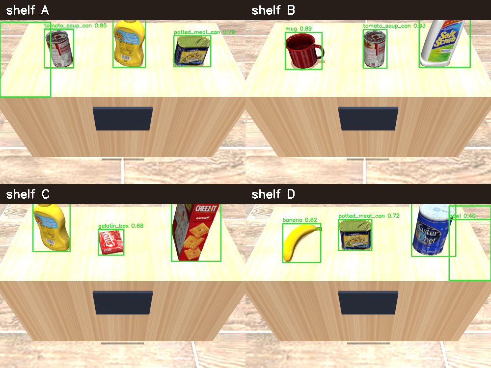

# Detect · Plan · Grasp

**Language-driven robotic manipulation** — tell a mobile robot what you want in plain English and it
finds, picks, and delivers the right object. An **on-device LLM agent** plans the task and calls the
robot's tools, re-planning as it observes results; a trained, **INT8-quantized** detector drives an
analytic grasp on a mobile base that navigates with A\*. Every stage verifies itself:
**perceive → decide → act → verify.**


> **"grab the soup can on shelf A and put it on shelf D"** → the robot parses the command, detects
> the soup among distractors on shelf A, drives over, grasps it, A\*-navigates around the shelves,
> and places it **upright** on shelf D — all detector-driven, no ground-truth pose.

## The system

Four cleanly separable stages, each independently validated, wired into one loop:

- **Perception (learned, optimized).** A YOLOv8-nano detector on the 21 YCB-Video objects, run
  through a full inference-optimization sweep — ONNX → **INT8 quantization** → benchmark — as a
  **torch-free** ONNX Runtime path. Detections are back-projected through depth into 3D positions.
  *(The ML-systems half.)*
- **Language & planning (on-device LLM).** For a direct instruction, the model grounds the sentence
  into a validated `{object, source, dest}` task against the store's shelf contents, with a
  deterministic rule parser as fallback. For open-ended goals it runs the robot as an **agent**,
  choosing and calling tools one at a time — see [Agentic control](#agentic-control).
  *(The reasoning layer.)*
- **Planning & control (from scratch).** Analytic grasp planning with a **verify-and-retry** grasp
  check, from-scratch **6-DOF Jacobian IK**, and **A\*/RRT** navigation around obstacles, in a MuJoCo
  physics sim. *(The robotics half.)*
- **Integration.** One command flows end to end: parse → navigate to the source → detect the object
  among distractors → grasp → navigate to the destination → place upright.

## Agentic control

Some instructions cannot be carried out as a fixed sequence. *"Put all the cans on shelf D"* has no
known length until the robot looks. *"Take the mug from shelf A"* is simply wrong if the mug is on
shelf B. Both need a system that chooses its next action from what it observes right now.

So the LLM runs the robot as an **agent**, through a **ReAct loop written from scratch** (no
LangChain, ~30 lines): it receives the goal, the available tools, and the robot's live state, emits
one tool call as JSON, observes the structured result, and re-plans — until it decides the job is
done. The stages below are the capabilities; the agent decides which to invoke, and when.


> **"put all the cans from shelf A onto shelf D"** — the agent decomposes one sentence into two
> pick-and-place cycles, correctly leaves the mustard bottle behind (it is not a can), and stops on
> its own. The caption is the tool call in flight.

**Action space** (`sim/agent_tools.py`) — `perceive(shelf)`, `grasp(object)`, `place(shelf)`,
`go_to(shelf)`, `world_state()`. Every tool is **fail-soft**: it returns a typed reason instead of
raising, so a failure becomes something the planner can re-plan around rather than a crash.

**The environment is the memory.** The agent is stateless across turns — no growing chat log. Each
turn it receives the robot's current `world_state()`, which keeps the prompt small and the reasoning
grounded in what is actually true rather than in what it previously said.

**Measured against a one-shot baseline** (`sim/eval_agent.py`) — same model, same tools, same goals,
but asked *once* for a complete plan which is then executed blindly. Success is scored from the
simulator's state, not the agent's report:

| System | Overall | single-object | recovery (wrong premise) | compositional |
|---|---|---|---|---|
| **agent** (ReAct loop) | **5/5 (100 %)** | 2/2 | 1/1 | 2/2 |
| baseline (one-shot plan) | 2/5 (40 %) | 2/2 | 0/1 | 0/2 |

The baseline solves exactly the goals where a blind plan is *accidentally* correct. It fails every
goal where the world has to talk back: it cannot discover that the mug is **not** on the shelf the
command names, and it cannot know how many cans sit on a shelf it has not looked at yet. Those plan
lengths and locations are unknowable in advance — a system that cannot re-plan cannot represent them.

Model choice was measured, not assumed: **Llama-3.2-3B parses reliably but cannot plan** (it loops
without ever grasping); **Qwen2.5-7B plans**. Both run locally on CPU.

**Where it falls short.** Task success is 5/5, but step efficiency is not solved — compositional goals take
11–12 steps against an optimal 6, and one run hit the step cap instead of terminating cleanly. The
agent also gives up on an object after two failed grasps and reports the skip, rather than pretending
it succeeded.

## How it got here

Built bottom-up, one verified milestone at a time (visual timeline + per-phase deep-dives in the
docs vault):

`01` block pick-and-place → `02` detector-driven grasp → `03` multi-object detection →
`04` language-driven rearrangement (local LLM) → `05` path planning (RRT-Connect) →
`06` **mobile manipulation** (detect · navigate · deliver) → `07` **prompt-driven store** →
`08` **agentic control** (the LLM plans, calls tools, and recovers from wrong instructions).


## Each piece, on its own

Every stage was built and validated independently before being wired together:

<table>
<tr>
<td width="50%" valign="top"><b>Detector (INT8 YOLO)</b> — YOLOv8-n identifies YCB objects from the arm's camera.<br/></td>
<td width="50%" valign="top"><b>Quantization sweep</b> — INT8: 2.1× smaller, 1.5× faster, &lt;2.5% mAP loss (head kept FP32).<br/></td>
</tr>
<tr>
<td width="50%" valign="top"><b>Real vs. synthetic</b> — training on real YCB-Video closed the sim→real gap (0.41 → 0.80 mAP).<br/></td>
<td width="50%" valign="top"><b>3D localization</b> — detection back-projected through depth, verified vs ground-truth poses (~30 mm).<br/></td>
</tr>
<tr>
<td width="50%" valign="top"><b>Grasp planning</b> — analytic top-down grasp + from-scratch 6-DOF Jacobian IK.<br/></td>
<td width="50%" valign="top"><b>Perception among distractors</b> — a per-shelf camera picks out each object in the store scene.<br/></td>
</tr>
</table>

## Results (measured)

| Stage | What | Result |
|---|---|---|
| Data | YCB-Video (BOP) → YOLO labels | 900 val imgs, leak-guarded |
| Train | YOLOv8-n on **real** data (vs synthetic) | **mAP50 0.80** (0.41 synthetic → sim→real gap closed) |
| Optimize | ONNX → INT8 (detection head kept FP32) | **2.1× smaller, 1.5× faster**, −2.4% mAP (CPU) |
| Lift | depth back-projection → 3D position | **~30 mm** error, verified vs ground-truth poses |
| Grasp | analytic planner + 6-DOF Jacobian IK, closed loop | detector-driven grasp on the tabletop (vs 2.5% no-perception baseline) |
| Mobile | detect → grasp → A\* navigate → place | delivers the commanded object **upright** across the scene |
| Store | natural-language command → end-to-end delivery | LLM-grounded pick-and-place among distractors, across shelves |
| **Agent** | ReAct loop vs one-shot planner, 5-goal suite | **100 % vs 40 %** task success; recovers from wrong commands |

The detector genuinely drives the robot: the arm renders its camera, the INT8 YOLO detects the
object, its box is lifted to a 3D world position, and the robot grasps and delivers it — an object it
was **not** told the location of.

**Honest limit:** the two-finger parallel gripper reliably handles cans and mugs; wide boxes, tapered
bottles, and thin curved objects are detected but defeat the pinch grasp (measured per object — the
agent detects every item on a shelf but can only pick a subset, and reports what it skipped) — a learned grasp model is
the natural next step.

## Stack

Python · Ultralytics YOLOv8 · ONNX Runtime · INT8 quantization · MuJoCo · Ollama (Llama 3.2,
Qwen2.5-7B) · from-scratch ReAct agent loop & tool-use · OpenCV · NumPy. From-scratch Jacobian IK, analytic grasp planning, A\*/RRT navigation.
Training on Colab GPU; inference, LLM, and sim run locally (CPU / Apple-Silicon, torch-free).

## Run it

```bash
python -m venv .venv && ./.venv/bin/pip install -r requirements.txt
bash sim/fetch_assets.sh                              # restore Panda meshes (gitignored)

# --- perception (needs a trained best.onnx in runs/ycb_artifacts — see notebooks/train_colab.ipynb)
./.venv/bin/python src/quantize_int8.py               # INT8 model
./.venv/bin/python src/benchmark.py                   # size / latency / mAP sweep
./.venv/bin/python src/lift_to_3d.py                  # 3D lift vs ground truth

# --- closed-loop grasp
./.venv/bin/python sim/run_detector.py --trials 25    # tabletop, detector-DRIVEN

# --- mobile manipulation & the prompt-driven store
./.venv/bin/python sim/make_scene_room.py             # (re)generate scenes
./.venv/bin/python sim/mobile_task.py tomato_soup_can # detect → grasp → navigate → place
./.venv/bin/python sim/store_language.py              # LLM command → validated task (needs `ollama serve`)
./.venv/bin/python sim/store_task.py "grab the soup can on shelf A and put it on shelf D"

# --- the agent (needs `ollama serve` + `ollama pull qwen2.5:7b`)
./.venv/bin/python sim/agent.py "put all the cans from shelf A onto shelf D"
./.venv/bin/python sim/agent.py "take the mug from shelf A to shelf C"   # the mug is NOT on A
./.venv/bin/python sim/eval_agent.py                                     # agent vs one-shot baseline
./.venv/bin/python sim/record_agent.py "clear shelf A onto shelf C" docs/demo.mp4
```

## Dataset

[YCB-Video](https://bop.felk.cvut.cz/datasets/) (via the BOP benchmark) — 21 household objects with
6D pose, masks, and depth. Only a subset is used; data is not committed.
